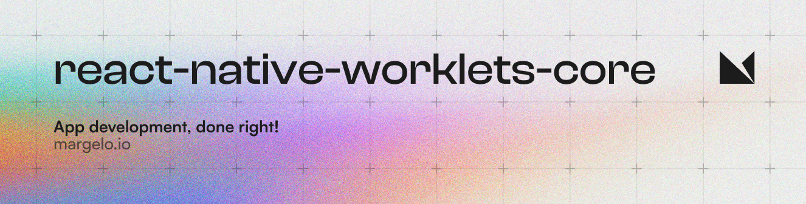

<a href="https://margelo.io">
  <picture>
    <source media="(prefers-color-scheme: dark)" srcset="./img/bg-dark.png" />
    <source media="(prefers-color-scheme: light)" srcset="./img/bg-light.png" />
    
  </picture>
</a>

# 🧵 react-native-worklets-core

A [Worklet](docs/WORKLETS.md) runner for React Native.

```js
const worklet = () => {
  'worklet'
  return Math.random()
}
```

## Installation

1. Install the library from npm:
    ```sh
    yarn add react-native-worklets-core
    ```
2. Add the babel plugin to your `babel.config.js`:
    ```js
    module.exports = {
      plugins: [
        ["react-native-worklets-core/plugin"],
        // ...
      ],
      // ...
    };
    ```
3. Restart Metro with clean cache:
    ```sh
    yarn start --reset-cache
    ```

## Requirements

- Requires react-native 0.75 or higher

## Usage

See [USAGE.md](docs/USAGE.md)

## Contributing

See the [contributing guide](CONTRIBUTING.md) to learn how to contribute to the repository and the development workflow.

## License

MIT

## Credits

* Credits go to [Christian Falch](https://github.com/chrfalch) for building the initial version of this library. You're amazing! 🤩
* Credits go to [Software Mansion](https://swmansion.com) for introducing the concept of [Worklets](https://docs.swmansion.com/react-native-reanimated/docs/fundamentals/worklets) in [Reanimated v2](https://github.com/software-mansion/react-native-reanimated). This library is inspired by Reanimated v2 with a few structural changes to the Worklets architecture to make it more flexible for different use-cases, such as integrating it with other C++ libraries like VisionCamera and WishList.
